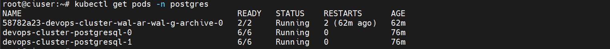
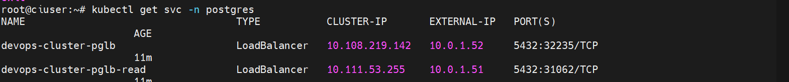
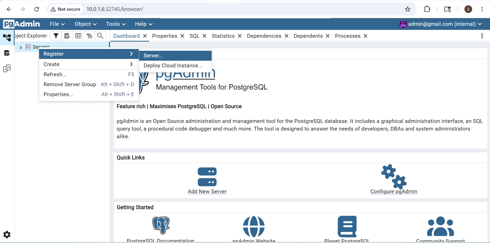
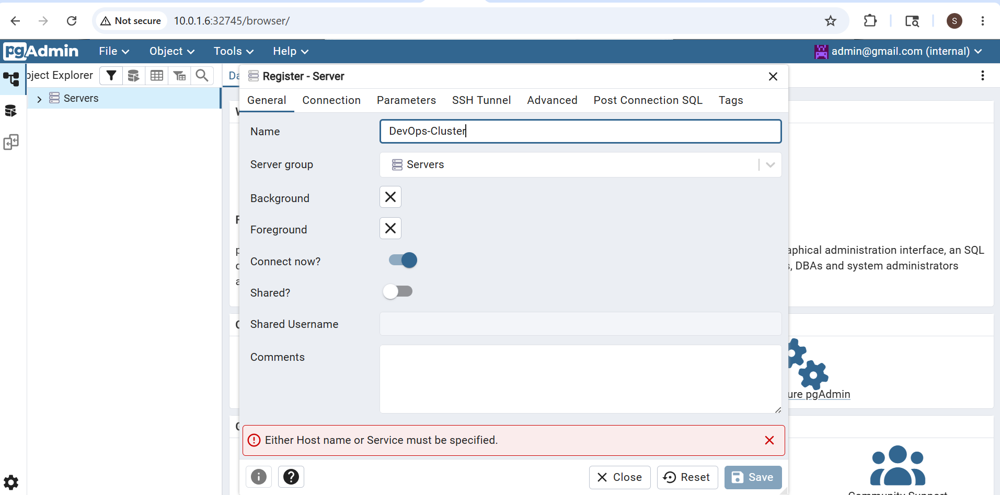
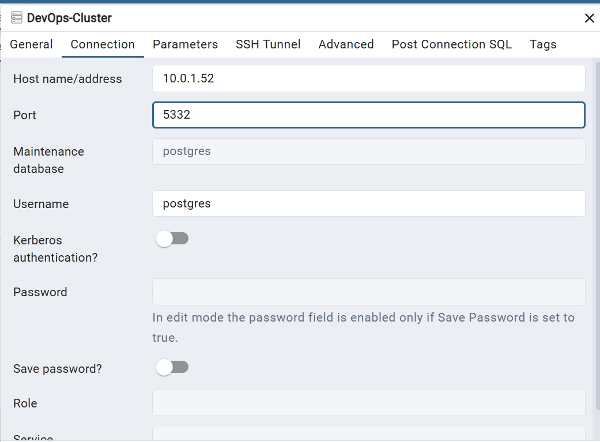
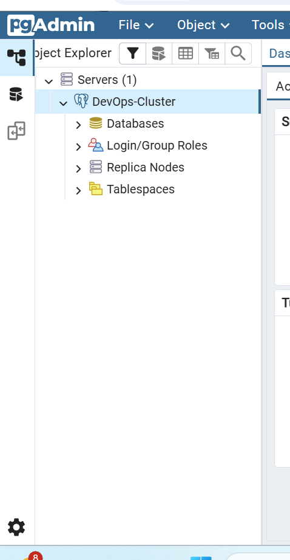

# Terraform KubeBlocks PostgreSQL Platform

PostgreSQL platform automation using Terraform, Kubernetes, Helm, and KubeBlocks.

This project automates:

- PostgreSQL HA cluster deployment
- Primary and Read Replica services
- MinIO backup integration
- WAL-G scheduled backups
- Continuous WAL archiving
- pgvector extension enablement
- pgAdmin PostgreSQL management UI

---

# Architecture

```text
Terraform
   │
   ├── Infrastructure Module
   │      ├── Snapshot Controller
   │      ├── KubeBlocks CRDs
   │      └── KubeBlocks Helm Deployment
   │
   ├── PostgreSQL Module
   │      ├── PostgreSQL HA Cluster
   │      ├── Primary LoadBalancer
   │      ├── Read Replica LoadBalancer
   │      └── PostgreSQL Database Password
   │
   ├── Backup Module
   │      ├── BackupRepo
   │      ├── WAL-G Full Backup Schedule
   │      └── WAL Archiving Schedule
   │
   ├── pgvector Module
   │      └── PostgreSQL Vector Extension
   │
   └── pgAdmin Module
          └── PostgreSQL Web UI
```

---

# Project Workflow

1. Deploy Kubernetes dependencies
2. Install KubeBlocks operators and CRDs
3. Provision PostgreSQL HA cluster
4. Configure BackupRepo and WAL-G
5. Enable pgvector extension
6. Deploy pgAdmin UI
7. Access PostgreSQL services

---

# Installation

## Clone Repository

```bash
git clone https://github.com/Durga-Sirisha-Karuturi/KubeBlocks-Terraform.git

cd KubeBlocks-Terraform
```

---

## Initialize Terraform

```bash
terraform init
```

---

## Configure Variables

Edit the Terraform variables file:

```bash
vim terraform.tfvars
```

Example configurations include:

- PostgreSQL credentials
- Storage class
- MinIO backup configuration
- Namespace settings
- Resource allocations

---

## Deploy Infrastructure

```bash
terraform apply -auto-approve
```

---

# Verify Deployment

## PostgreSQL Pods

```bash
kubectl get pods -n postgres
```

### PostgreSQL Cluster Pods



---

## PostgreSQL Services

```bash
kubectl get svc -n postgres
```

---

## Backup Repository

```bash
kubectl get backuprepo -n postgres
```

---

## Backup Schedules

```bash
kubectl get backupschedules -n postgres
```

---

## pgvector OpsRequests

```bash
kubectl get opsrequest -n postgres
```

---

## pgAdmin Service

```bash
kubectl get svc -n pgadmin
```

---

# Service Purpose

| Service | Purpose |
|----------|----------|
| `pglb` | Primary writable endpoint |
| `pglb-read` | Read replica endpoint |

### PostgreSQL Services



---

# pgAdmin Access

## Get NodePort

```bash
kubectl get svc -n pgadmin
```

---

## Open in Browser

```text
http://<NODE-IP>:<NODEPORT>
```

---

## Login Credentials

```text
Email: admin@gmail.com
Password: admin123
```

---

# Register Cluster into pgAdmin

## Step 1: Register Server

Open pgAdmin dashboard.

Right click on **Servers** → Click **Register** → **Server**



---

## Step 2: Give Cluster Name

Enter a cluster name that should be displayed inside pgAdmin.

Example:

```text
DevOps-Cluster
```



---

## Step 3: Configure Connection

In the **Connection** tab:

- Host name/address → Give PostgreSQL LoadBalancer service endpoint
- Port → `5432`
- Username → `postgres`
- Password → PostgreSQL password created during deployment

Enable:

- Save Password



---

## Step 4: Connected PostgreSQL Cluster

After saving, the PostgreSQL cluster will appear in pgAdmin.



---
```
